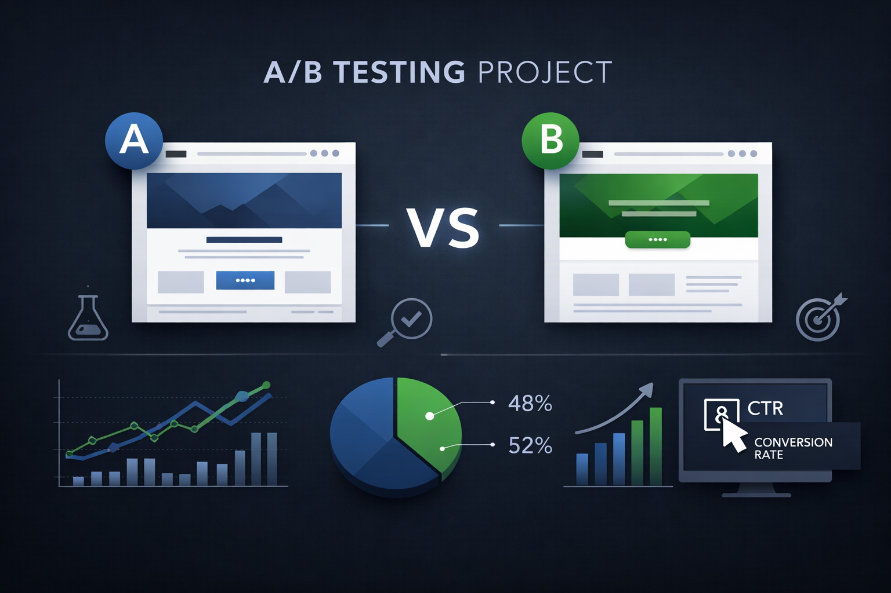
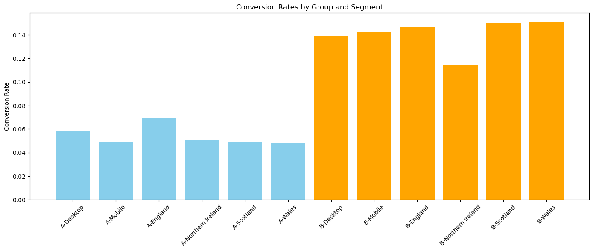
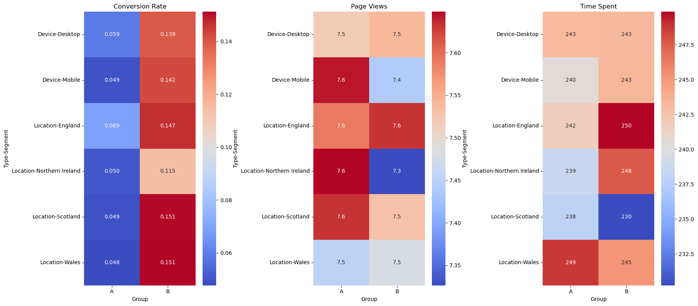
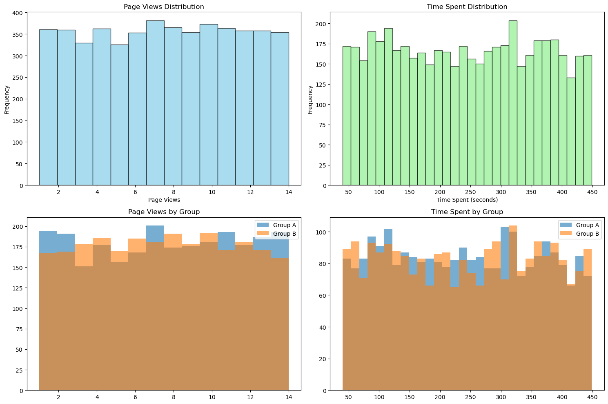

# A/B Testing Analysis: Website Background Color Impact




---

## Overview

This project analyzes whether changing a UK-based retail website's background color from white to black has a statistically significant impact on user engagement and conversion rates, using a publicly available dataset from Kaggle. Using A/B testing methodology and rigorous statistical analysis, the project determines whether the proposed design change is worth implementing.

**Business Problem:** Does a black website background drive more conversions compared to the current white background — without sacrificing user engagement?

---

## Key Features

- Full A/B test pipeline: hypothesis setup, data exploration, statistical testing, and business interpretation
- Segment analysis across device type (Mobile/Desktop) and location (England, Scotland, Wales, Northern Ireland)
- Multiple statistical tests: Z-test for proportions, Mann-Whitney U test, Cohen's h effect size
- Business impact analysis with practical significance assessment
- Clean visualizations including distribution plots, segment heatmaps, and conversion comparison charts

---

## Dataset

| Property | Detail |
|----------|--------|
| Source | [Kaggle - A/B Testing Practice Dataset](https://www.kaggle.com/datasets/adarsh0806/ab-testing-practice) |
| Size | 5,000 users |
| Features | User ID, Group (A/B), Page Views, Time Spent, Conversion, Device, Location |
| Control Group (A) | 2,519 users — White background |
| Treatment Group (B) | 2,481 users — Black background |
| Class Balance | No missing values, no duplicates, near-equal group split (50.4% / 49.6%) |

---

## Tech Stack

- **Python 3.9+**
- **Pandas** — data manipulation and exploration
- **NumPy** — numerical computations
- **SciPy** — statistical tests (Z-test, Mann-Whitney U)
- **Matplotlib / Seaborn** — visualizations
- **Jupyter Notebook** — analysis environment

---

## Installation

```bash
# Clone the repository
git clone https://github.com/yourusername/ab-testing-analysis.git
cd ab-testing-analysis

# Create and activate virtual environment
python -m venv venv
source venv/bin/activate  # On Windows: venv\Scripts\activate

# Install dependencies
pip install -r requirements.txt
```

---

## Project Structure

```
ab-testing-analysis/
├── README.md
├── requirements.txt
├── dataset/
│   └── ab_testing.csv
├── notebook/
│   └── ab_testing_analysis.ipynb
└── images/
    ├── banner.png
    ├── conversion_comparison.png
    ├── segment_heatmap.png
    └── distribution_plot.png
```

---

## How to Run

```bash
# Launch Jupyter Notebook
jupyter notebook notebook/ab_testing_analysis.ipynb
```

Run all cells sequentially. The notebook is structured in order: data loading → exploration → statistical testing → business analysis.

---

## Results

### Statistical Findings

| Metric | Test Used | Result | p-value |
|--------|-----------|--------|---------|
| Conversion Rate | Z-test (one-tailed) | ✅ Significant | < 0.001 |
| Page Views | Mann-Whitney U | ❌ No difference | 0.425 |
| Time Spent | Mann-Whitney U | ❌ No difference | 0.642 |

### Key Numbers

- **Group A (White):** 5.4% conversion rate (136 / 2,519 users)
- **Group B (Black):** 14.1% conversion rate (349 / 2,481 users)
- **Improvement:** +8.7 percentage points (Cohen's h = 0.30, medium effect)
- **Consistent across all segments:** Black background outperformed white in every device and location segment by 6–10 percentage points

### Business Interpretation

The black background **significantly improves conversion rates** without negatively affecting how users browse — time spent and page views remained identical across both groups. The effect is isolated to conversion behavior only, indicating a design-level influence on purchase decisions.

### Visualizations

**1. Conversion Rate by Segment**
Group B (black background) consistently outperforms Group A (white background) across all device types and locations.



**2. Segment Heatmap**
Heatmap confirms strong conversion rate contrast between groups while page views and time spent remain similar.



**3. Distribution Analysis**
Page views and time spent distributions are nearly identical between groups — confirming the effect is isolated to conversion only.



> ⚠️ **Note:** This dataset was created for practice purposes and may show larger effects than typical real-world A/B tests. Always validate findings with production data before implementation.

---

## Future Work

- Validate findings with real-world data from an actual A/B testing platform (e.g., Google Optimize, Optimizely)
- Extend test duration (minimum 2–4 weeks) to account for novelty effects and seasonal variation
- Add device-specific conversion analysis to check if mobile and desktop users respond differently
- Incorporate revenue per user as an additional business metric beyond conversion rate
- Run multivariate tests combining background color with other design variables (font color, button style)

